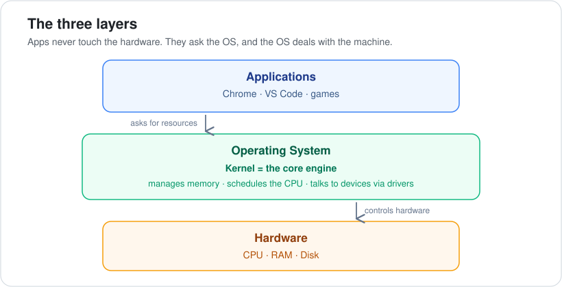
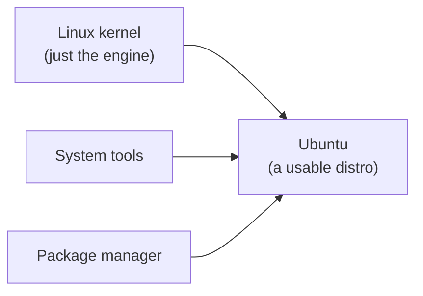

# 01 · Operating Systems

**Part 1 — Foundations** · ✅ Done

> This is where my DevOps journey started. Before this I never really thought about *what an OS actually does*. It turns out almost everything in DevOps — servers, cloud machines, containers — runs on Linux, so understanding the operating system first made everything after it click.

### 📌 What's in here

| # | Topic | In one line |
|:-:|---|---|
| 1 | [What it is](#1-what-it-is) | The layer between apps and hardware |
| 2 | [Why it exists](#2-why-it-exists) | Translator + referee |
| 3 | [The big picture](#3-the-big-picture) | The three layers |
| 4 | [The kernel](#4-the-kernel) | The real engine of the OS |
| 5 | [Memory: RAM vs disk vs swap](#5-memory-ram-vs-disk-vs-swap) | Fast, permanent, and overflow |
| 6 | [Kernels & Linux distros](#6-kernels--linux-distros) | Why Linux and Mac feel alike |
| ✔ | [Watch out](#-watch-out) · [What confused me](#-what-confused-me) | |

---

## 1. What it is

An **operating system (OS)** is the software layer that sits between your applications and your hardware. I think of it as two things at once:

- a **translator** — it turns simple app requests into real hardware actions, and
- a **referee** — it keeps many apps fairly sharing one set of hardware.

## 2. Why it exists

Apps can't talk to the hardware directly, for two reasons:

1. **Too many kinds of hardware.** Every app would need custom code for every possible CPU and chip. Impossible.
2. **Something has to referee.** Many apps share one limited set of hardware. Without a referee they'd overwrite each other's memory and fight over the processor.

The OS solves both: apps make simple requests, and the OS handles the messy hardware details underneath.

## 3. The big picture

The key idea: **apps never touch the hardware.** They just ask — *"give me memory," "save this file," "send this over the network"* — and the OS deals with the actual hardware. That's **abstraction**, and it's why the same app can run on very different machines.

## 4. The kernel

The **kernel** is the true core of the OS — the real engine. It:

- manages **memory**,
- schedules the **CPU** (decides which program runs next), and
- talks to devices through **drivers**.

When people say "OS," they loosely mean *kernel + tools + the interface you see*. But the kernel is the part doing the real work.

## 5. Memory: RAM vs disk vs swap

This trio confused me at first, so here they are side by side:

| Type | Speed | Persistence | What it is |
|---|---|---|---|
| **RAM** | Fast | **Volatile** — lost on power off | Temporary working memory |
| **Disk** | Slow | **Non-volatile** — survives shutdown | Permanent storage |
| **Swap** | Slow (it *is* disk) | — | Overflow used when RAM fills up |

**Swap** is the one worth understanding: when RAM fills up, the OS moves inactive data out to disk to free up space. It's a **last resort** — relying on it too much makes the machine crawl, which is called **thrashing**.

> [!IMPORTANT]
> RAM and disk are not the same thing. **RAM = fast, temporary working memory. Disk = slow, permanent storage.** Mixing these up makes everything else about performance confusing.

## 6. Kernels & Linux distros

Different operating systems are built on different kernels:

| Operating system | Kernel |
|---|---|
| Android | **Linux** |
| macOS & iOS | **Darwin** |
| Windows | **NT** |

Linux and macOS *feel* similar — the same terminal commands work on both — because both come from the **Unix family**.

And here's the distinction that finally made "Linux" make sense to me:

- **Linux by itself is just the kernel.**
- A **distribution (distro)** = kernel **+** system tools **+** a package manager, bundled into something actually usable.
- **Ubuntu** is a distro.

### Why this matters for DevOps

Almost all servers, cloud machines, and containers run **Linux**, usually with **no graphical interface** — just the terminal. Getting comfortable in the terminal is basically the whole game from here on.

---

## ⚠️ Watch out

- **RAM is not the hard drive.** RAM = fast working memory; disk = slow permanent storage.
- **Swap is a last resort**, not the normal state. Constant swapping = thrashing = a slow machine.
- It's a **"distribution" (distro)**, not a "distributor."
- **Android is not desktop Linux** — it just reuses the Linux kernel.

## 🤔 What confused me

> I thought Linux and Mac were similar *"because of Ubuntu."* The real reason is that both come from the **Unix family**. Ubuntu is just one Linux distro; it has nothing to do with macOS.

---

[🏠 Index](../README.md) · [02 · Virtualization & Virtual Machines ➡](../02-virtualization-and-virtual-machines/README.md)
