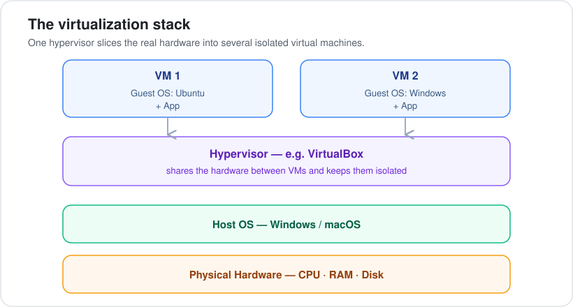
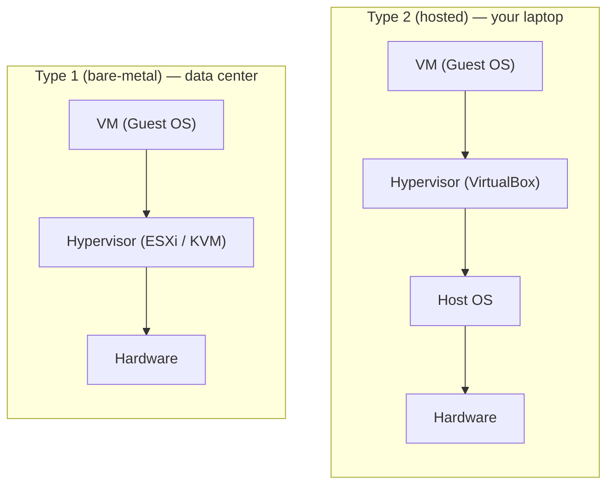

# 02 · Virtualization & Virtual Machines

**Part 1 — Foundations** · ✅ Done

> Once I understood what an OS is, the next question was: can one computer run *several* OSes at once? That's virtualization. It's the idea the whole cloud is built on, and it's also how I can run Linux for DevOps without wiping Windows off my laptop.

### 📌 What's in here

| # | Topic | In one line |
|:-:|---|---|
| 1 | [What it is](#1-what-it-is) | One physical machine → many virtual ones |
| 2 | [Why it exists](#2-why-it-exists) | Idle servers were wasted money |
| 3 | [The big picture](#3-the-big-picture) | The virtualization stack |
| 4 | [Host vs Guest OS](#4-host-os-vs-guest-os) | Which OS is which |
| 5 | [The hypervisor](#5-the-hypervisor) | The supervisor sharing the hardware |
| 6 | [Type 1 vs Type 2](#6-type-1-vs-type-2) | Bare-metal vs hosted |
| 7 | [The cloud & why VMs are heavy](#7-the-cloud--why-vms-are-heavy) | Where this leads next |
| ✔ | [Watch out](#-watch-out) · [What confused me](#-what-confused-me) | |

---

## 1. What it is

**Virtualization** is splitting one physical computer into several separate, isolated virtual computers. A **virtual machine (VM)** is a whole computer that runs as *software* inside your real one.

## 2. Why it exists

Companies used to buy a **whole physical server per app**. Each server sat mostly idle (wasted money) and took weeks to set up. Virtualization lets **one machine safely run many** apps, each in its own isolated box.

On a personal level, it's also how I can run Linux for DevOps **without wiping Windows off my laptop** — Linux just runs inside a VM.

## 3. The big picture

Reading it top to bottom: each **VM** has its own guest OS and app → the **hypervisor** shares the real hardware between them → the **host OS** is your real system → and it all runs on the **physical hardware**.

## 4. Host OS vs Guest OS

Two words that are easy to mix up:

| Term | Meaning | Example |
|---|---|---|
| **Host OS** | Your real OS, on the physical machine | Windows / macOS |
| **Guest OS** | The OS running *inside* the VM | Ubuntu |

A big reason VMs are useful: a VM is **isolated**. Anything that happens inside it **can't harm your real machine**. Break it, delete it, spin up a fresh one — your actual laptop is untouched. That's what makes VMs safe to experiment in.

## 5. The hypervisor

The **hypervisor** is the "supervisor" that shares the real hardware — CPU, RAM, disk — between the host and the VMs, and keeps them separated so they can't interfere with each other.

**VirtualBox** is the hypervisor I'll use on my laptop for learning.

## 6. Type 1 vs Type 2

There are two kinds of hypervisor. The whole difference is **one layer**: whether there's a host OS underneath.

| | Type 2 (hosted) | Type 1 (bare-metal) |
|---|---|---|
| **Runs on** | Top of a host OS, as an app | Directly on the hardware |
| **Used for** | Learning / testing on your laptop | Data centers, production |
| **Example** | VirtualBox | VMware ESXi, KVM |

Notice Type 1 has **no host OS** — the hypervisor sits straight on the hardware. That's why it's used where performance matters.

## 7. The cloud & why VMs are heavy

**The cloud is Type 1 virtualization at scale.** Renting a server from **AWS (EC2)** or **DigitalOcean (a droplet)** means getting **one VM sliced off a big physical server** by a hypervisor. That's it — that's what "the cloud" is underneath.

But VMs have a cost: each one carries a **full guest OS** — gigabytes in size, slow to boot. That weight is exactly the problem the next big idea solves.

> [!NOTE]
> **Coming next: containers.** They're like VMs but much lighter — instead of each carrying a full guest OS, they **share the host's kernel**. Same isolation idea, far less weight.

---

## ⚠️ Watch out

- **Every VM has its own full OS inside it** — that's *why* VMs are heavy.
- **Type 1 being "for production" is about where it's used, not security.** Both types isolate their VMs.

## 🤔 What confused me

> I thought Type 1 being "serious/fast" meant it was the **more secure** one. It actually just means it's the kind used for **real production workloads** in data centers. Both types isolate their VMs just fine.

---

[⬅ 01 · Operating Systems](../01-operating-systems/README.md) · [🏠 Index](../README.md)
