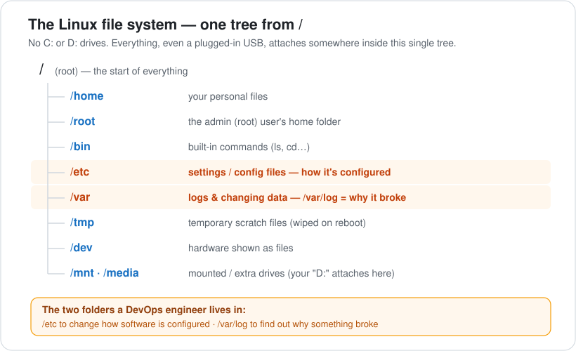
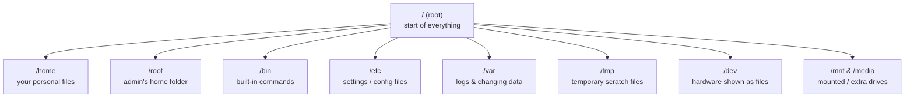

<div align="center">

# 03 · Linux File System

**Part 2 — Linux & Networking** · ✅ Done

</div>

> Once I knew that servers and containers all run Linux, the next thing I needed was a map: where does everything actually live? In Linux there are no `C:` or `D:` drives — it's **one single tree** starting from `/`. Learning this map genuinely feels like half of knowing how to fix a server.

### 📌 What's in here

| # | Topic | In one line |
|:-:|---|---|
| 1 | [What it is](#1-what-it-is) | One tree, starting at `/` |
| 2 | [Why it matters](#2-why-it-matters) | Every file has a predictable home |
| 3 | [The map](#3-the-map--main-folders) | The main folders and what they hold |
| 4 | [Explore it yourself](#4-explore-it-yourself) | Peek at the tree from the terminal |
| ✔ | [Watch out](#-watch-out) · [Try it](#-try-it) · [What confused me](#-what-confused-me) | |

---

## 1. What it is

The Linux file system is how Linux organizes all files and folders: as a **single hierarchical tree with one starting point**, the **root directory `/`**. Every other folder is a branch growing out of `/`.

> [!NOTE]
> There are no separate `C:` / `D:` drives like on Windows. Every file, folder, and even a plugged-in USB attaches somewhere *inside* this one tree.

## 2. Why it matters

- It gives every kind of file a **predictable home**, so both you and your programs always know where to look.
- As a DevOps engineer you live on servers, and two folders are where the real work happens:
  - **`/etc`** → change *how* software is configured.
  - **`/var/log`** → find out *why* something broke.
- Knowing this map is basically half of fixing a server.

## 3. The map — main folders

<p align="center"></p>

| Folder | What it holds |
|---|---|
| `/` | **Root** — the start of the whole tree. Everything lives inside it. |
| `/home` | Your personal files. Each user gets a folder like `/home/yourname` (like `C:\Users\YourName`). |
| `/root` | The **home folder of the admin (root) user** — their version of `/home`. |
| `/bin` | The built-in commands (the actual `ls`, `cd`… programs live here). |
| `/etc` | All the **settings / config files** for programs. |
| `/var` | Data that changes while the system runs — most importantly **logs** in `/var/log`. |
| `/tmp` | Temporary scratch files. Usually **wiped on reboot** — never keep anything here. |
| `/dev` | Your **hardware shown as files** (disks, USB…). This is the "everything is a file" idea. |
| `/mnt` & `/media` | Where **extra / plugged-in drives get mounted** into the tree (no `D:` drive — it attaches here). |

> [!TIP]
> You'll also see `/usr` (installed apps), `/boot` (files that start the system), `/lib` (shared code), `/opt` (third-party software), and `/proc` & `/sys` (live system info, not real files). These are system plumbing you rarely touch by hand as a beginner — just recognize the names.

### The building analogy

Picture `/` as a building: `/home` is the residents' apartments, `/etc` is the control room full of switches, `/var` is the logbook, `/bin` is the toolbox, and `/dev` is the wiring panel. Every kind of thing has its designated room.

### The same tree, as a diagram



## 4. Explore it yourself

Full command-line usage is the next section, but I can already peek:

```bash
ls /          # list everything directly under root
ls /home      # see the user folders inside /home
pwd           # print where you currently are
```

**Example — `ls /`**

```bash
ls /
```

Typical output (I'll replace this with my own once I run it):

```text
bin  boot  dev  etc  home  lib  media  mnt  opt  proc  root  run  sbin  srv  sys  tmp  usr  var
```

---

## ⚠️ Watch out

- **No `C:` / `D:` drives.** Everything is under `/`. A USB stick doesn't become "D:" — it gets mounted into the tree (usually under `/media`).
- **`/etc` vs `/var/log`.** `/etc` = settings (*how* it's configured). `/var/log` = logs (*what happened / why it broke*). Don't mix them up.
- **`/tmp` is wiped on reboot.** Never store anything you want to keep there.
- **"root" means three different things** — see below.

## 🧪 Try it

> Open your terminal and run `ls /`. Then answer: after a program crashes, which folder do you open to read the logs — and which folder do you open to change that program's settings?

<details>
<summary>Show answer</summary>

- Read logs after a crash → **`/var/log`**
- Change settings → **`/etc`**

</details>

## 🤔 What confused me

> The word **"root"** means **three** separate things, and they all sound identical:
>
> 1. **`/`** — the *root directory*, the top of the whole tree.
> 2. **`root`** — the *root user*, the all-powerful admin account (like Administrator on Windows).
> 3. **`/root`** — the *home folder that belongs to the root user* (their version of `/home/yourname`).
>
> So `/` (top of tree) and `/root` (admin's home) are **not** the same place — `/root` is just one branch inside `/`, sitting right next to `/home`. Three hats for one word: **the top, the person, and the person's room.**

---

**One-line recap:** Linux = one tree from `/`; your files in `/home`, settings in `/etc`, logs in `/var/log`, hardware in `/dev`; and "root" = the top of the tree, the admin user, and the admin's home folder.

---

[⬅ 02 · Virtualization & Virtual Machines](../02-virtualization-and-virtual-machines/README.md) · [🏠 Index](../README.md)
