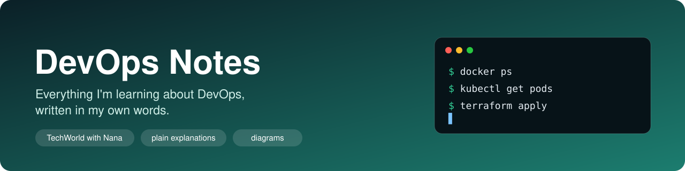

<div align="center">



<br><br>


</div>

## 👋 Hey, welcome to my notes

I'm working through the **DevOps Bootcamp by TechWorld with Nana**, and I'm writing down everything I learn here, in my own words, explained the way it finally clicked for me.

This repo is two things for me:

- **My own documentation.** When I forget how something works, I come here before I google it.
- **A record of what I've learned.** From what an operating system actually is, all the way to containers, Kubernetes, CI/CD and cloud.

These are student notes, written while learning. If you spot a mistake, please open an issue — I'd genuinely love to learn from it.

## 🧭 How I write every page

Every topic follows the same structure (my template is in [TEMPLATE.md](TEMPLATE.md)):

| Part | What it gives you |
|---|---|
| **What it is** | A plain-English definition |
| **Why it exists** | The problem it solves |
| **Key points** | The core ideas, broken down |
| **Visual** | A diagram, when a picture explains it better |
| **⚠️ Watch out** | Mistakes and misconceptions to avoid |
| **🤔 What confused me** | The thing that tripped me up |

Tool sections (Docker, Kubernetes, Terraform...) also include **commands** and **real examples**. Where I can run a tool myself the output is real; where it needs a cluster or a paid cloud account I mark the output as *illustrative* rather than pretend I tested it.

## 🗺️ What I've covered so far

**Progress:** `██░░░░░░░░░░░░░░` 2 / 16 sections

**Legend:** ✅ written · 🚧 in progress · ⬜ not yet

### Part 1 — Foundations

What an operating system is, how virtualization works, and why the whole cloud runs on these ideas.

| # | Section | What's inside | Status |
|:-:|---|---|:-:|
| 01 | [Operating Systems](01-operating-systems/README.md) | What an OS is, the kernel, RAM vs disk vs swap, Linux distros | ✅ |
| 02 | [Virtualization & Virtual Machines](02-virtualization-and-virtual-machines/README.md) | VMs, the hypervisor, Type 1 vs Type 2, how the cloud uses it | ✅ |

### Part 2 — Linux & Networking

The terminal, shell scripting, and how machines talk to each other.

| # | Section | What's inside | Status |
|:-:|---|---|:-:|
| 03 | Linux Basics & Shell | Files, permissions, processes, the commands I'll use every day | ⬜ |
| 04 | Shell Scripting | Writing scripts to automate repetitive tasks | ⬜ |
| 05 | Networking Fundamentals | IPs, ports, DNS, firewalls, how data moves between machines | ⬜ |

### Part 3 — Version Control & Build Tools

Tracking changes and turning source code into something deployable.

| # | Section | What's inside | Status |
|:-:|---|---|:-:|
| 06 | Version Control with Git | Commits, branches, merges, working with remotes | ⬜ |
| 07 | Build & Package Manager Tools | Maven, Gradle, npm — turning code into artifacts | ⬜ |
| 08 | Artifact Repository Manager | Nexus — storing and serving built artifacts | ⬜ |

### Part 4 — Cloud & Containers

Running apps in the cloud, then packaging them into containers.

| # | Section | What's inside | Status |
|:-:|---|---|:-:|
| 09 | Cloud & IaaS Basics | What the cloud actually is, AWS/DigitalOcean, regions, pricing | ⬜ |
| 10 | Containers with Docker | Images, containers, Dockerfile, volumes, networking | ⬜ |

### Part 5 — Container Orchestration

Managing containers at scale with Kubernetes.

| # | Section | What's inside | Status |
|:-:|---|---|:-:|
| 11 | Container Orchestration with Kubernetes | Pods, services, deployments, the cluster architecture | ⬜ |
| 12 | Managed Kubernetes on AWS | EKS, managed node groups, deploying to a real cluster | ⬜ |

### Part 6 — CI/CD Pipelines

Automating the build → test → deploy cycle.

| # | Section | What's inside | Status |
|:-:|---|---|:-:|
| 13 | CI/CD with Jenkins | Pipelines, Jenkinsfile, integrating with Docker and K8s | ⬜ |

### Part 7 — Infrastructure as Code

Defining and managing infrastructure with code instead of clicking.

| # | Section | What's inside | Status |
|:-:|---|---|:-:|
| 14 | Infrastructure as Code with Terraform | Providers, resources, state, plan & apply | ⬜ |
| 15 | Configuration Management with Ansible | Playbooks, inventory, automating server setup | ⬜ |

### Part 8 — Monitoring

Watching what's running and knowing when something breaks.

| # | Section | What's inside | Status |
|:-:|---|---|:-:|
| 16 | Monitoring with Prometheus | Metrics, exporters, Grafana dashboards, alerting | ⬜ |

## 📁 How this repo is organized

```
devops-notes/
├── README.md          ← you are here
├── TEMPLATE.md        ← the structure every page follows
├── assets/            ← the banner
├── 01-operating-systems/
│   ├── README.md      ← the notes (GitHub opens this automatically)
│   └── images/        ← diagrams for this section
├── 02-virtualization-and-virtual-machines/
│   ├── README.md
│   └── images/
├── 03-linux-basics-and-shell/
├── 04-shell-scripting/
├── ...                ← one folder per section, as I write them
└── 16-monitoring-with-prometheus/
```

Each section folder contains:

```
01-operating-systems/
├── README.md          ← the notes (GitHub opens this automatically)
└── images/            ← diagrams for that section
```

---

<div align="center">

Made while learning, one section at a time. 🐘 → 🐳 → ☸️

</div>
